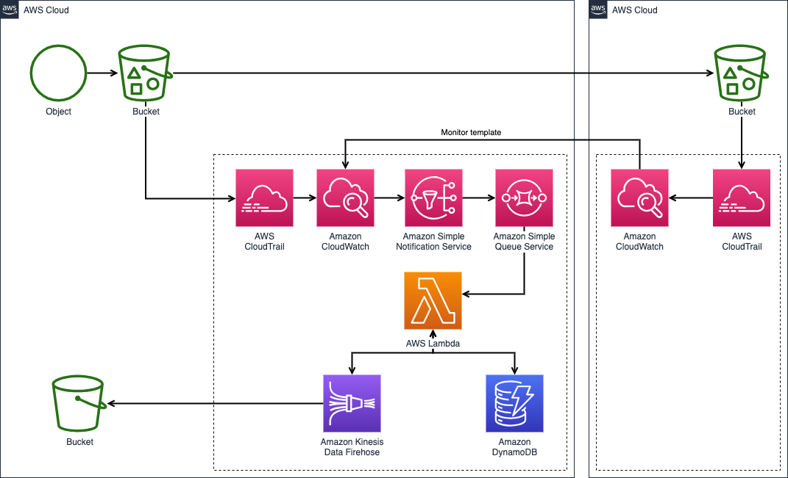

# followsleuth
Python-based Telegram Bot to track X.com Web3 profiles new followings

## Requirements:
- Python 3.11.1
- requirements.txt (```use pip3 install -r requirements.txt```)
- Chrome
- chromedriver (make sure version compatible with Chrome browser version, check on https://googlechromelabs.github.io/chrome-for-testing/)
- ca.rt file (Download from https://raw.githubusercontent.com/wkeeling/selenium-wire/master/seleniumwire/ca.crt and add cert to trusted certificates in system)
- secret.env (set up your own credentials)

## Overall Architecture


## How it works?
- Set up bot and get bot token from Telegram BotFather
- tele_bot.py act as the 'backend' of the bot to receive commands from Telegram server through long polling and perform database CRUD operations
- scraper.py to run hourly intervals to scrape following's data using selenium, updates records in database and pushes new notifications to users if any

## Preview


## Future Improvements
- Use webhook instead of long polling as long polling can be requests intensive (looking into FASTAPI)\
  **[Current Status: Successful as of 27/05/2024)]**

- Apache Airflow to run scraper.py


- Look for alternatives ways or libraries for scraping as Selenium can be slow (looking into Playwright)
